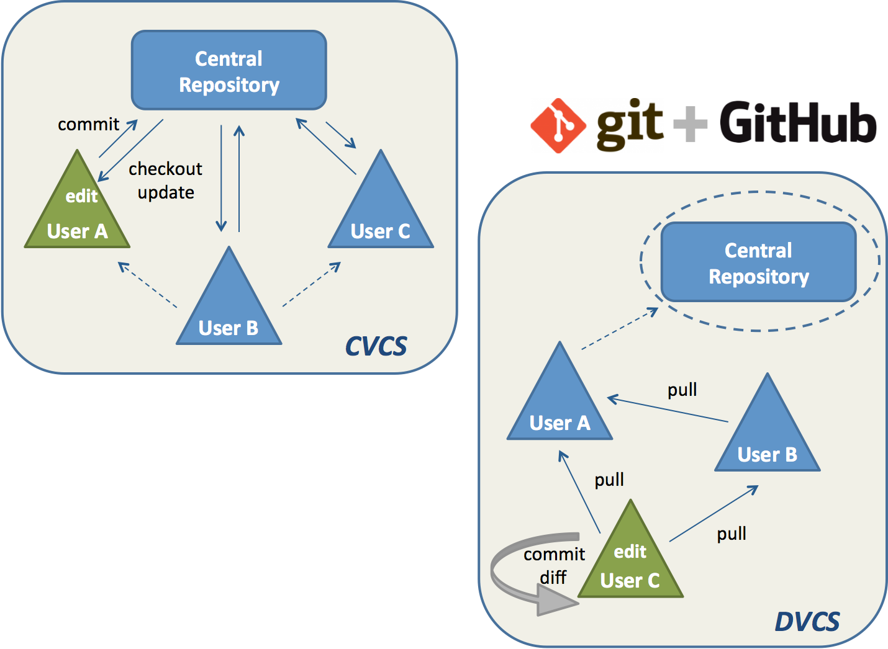

---

What ist git?
===============

* the most widely used modern version control system in the world today
* originally developed in 2005 by Linus Torvalds

* Distributed Version Control System (DVCS)

---

What is DVCS?
-------------

* Centralized version control systems (CVCS) focuses on synchronizing, tracking, and backing up files.
* Distributed version control systems (DVCS) focuses on sharing changes; every change has a guid or unique id.
* Recording/downloading and applying a change are separate steps (in a centralized system, they happen together).

---

* Distributed systems have no forced structure. You can create “centrally administered” locations or keep everyone as peers.
* DVCS new terminology
    * **Pushes** refer to sending a change to another repository (permissions may be required)
    * **Pulls** refer to grabbing a change from a repository

--- 



---


---


Advantages
----------------

* Everyone has their own local sandbox.
* git works offline.
* git is fast.
* Branching and merging is easy.


---

Disadvantages
--------------

* You still need a backup.
* You still want a machine to push changes.
* There’s not really a “latest version”
* There aren’t really revision numbers.

--- 

git Basics
===========

---


getting help
-------------- 

```shell

$ git help log
$ git log --help


``` 

---

setting up git user
--------------------

```shell

$ git config --global user.name "Your Name Comes Here"
$ git config --global user.email you@yourdomain.example.com

```

**(not your git credentials)**  

---

init new git repository
-------------------------

```shell

$ cd /path/to/repo
$ git init
Initialized empty Git repository in /path/to/repo/.git/

```

---

check status 
-----------------

```shell

$ git status
On branch master

No commits yet

...

```

---

add file(s) to git
-----------------

```shell

$ touch file1 file2 file3
$ # git add . 
$ # git add *
$ git add file1 file2 file3
$ git status

On branch master

No commits yet

Untracked files:
  (use "git add <file>..." to include in what will be committed)

        file1.c
        file2.c
        file3.c

nothing added to commit but untracked files present (use "git add" to track)

```
---

adding files interactive
-------------------------

```shell
$ git add -i
           staged     unstaged path
  1:    unchanged        +0/-1 TODO
  2:    unchanged        +1/-1 index.html
  3:    unchanged        +5/-1 lib/simplegit.rb

*** Commands ***
  1: status     2: update      3: revert     4: add untracked
  5: patch      6: diff        7: quit       8: help
What now>
```

---

remove from staging area
-------------------------

```shell

$ git rm --cached file1
rm 'file1' 

$ ls
file1 file2 file3

```
--- 

revert changes on file
-----------------------

```shell
$ git checkout -- file1 
```

---

commiting changes 
------------------

add commit message 

```shell

$ git commit -m "my commit message"
[master (Basis-Commit) 3074e91] my commit message
 3 files changed, 0 insertions(+), 0 deletions(-)
 create mode 100644 file1
 create mode 100644 file2
 create mode 100644 file3

```

---

add commit message in editor

 ```shell
$ git config --global core.editor nano
$ #or ($VISUAL or $EDITOR)
$ git config core.editor  
nano
$ git commit

```

---

Tags
===========

---

* tag specific points in history as being important

* **lightweight tag**: just a pointer to a specific commit

* **annotated tag**: contains tagger name, email, date, tagging message

---

adding tags 
------------


```shell
$ git tag
$ git tag tag1
$ git tag tag2
$ git tag
tag1
tag2
$ git tag -l '*2'
tag2

$ git tag -a V1.8.5 -m "release version V 1.8.5"
```

---

Branching and Merging
=====================

--- 

create branch
---------------

```shell

$ git branch branch1
$ git branch  
  branch1
* master
$ git checkout branch1
$ git branch
* branch1
  master

```

---

create branch and checkout 
---------------------------

```shell

$ git checkout -b branch2
Zu neuem Branch 'branch2' gewechselt
$ git branch
  branch1
* branch2
  master
```
---

delete local branch 
--------------------

```shell 

$ git branch -d branch1
$ git branch
* branch2
  master

```
---

rename branch
--------------

```shell

$ git branch -m branch2 branch1
$ git branch 
* branch1
  master
```

---

merging branches 
------------------

```shell
$ git checkout master # switch to master branch
$ git merge branch1
Aktualisiere 933c510..c4c9e2f
Fast-forward
 file1 | 0
 1 file changed, 0 insertions(+), 0 deletions(-)
 create mode 100644 file1
```
---

set merge tool
---------------

```shell
git config --global --add merge.tool kdiff3
``` 

--- 
rebase branches 
----------------

```shell
$ git rebase master 
```

---

merge vs rebase? 
----------------

---

Exploring history 
==================

---

commit ids
------------

```
$ git log
commit 933c51027acf9956c6e02950e92af72e277200b1
Author: Florian Schimmer <florian.schimmer@conplement.de>
...
```
---

tags 
------

```
$ git tag
```

---

versions 
---------------

```
HEAD - newest commit in actual branch
HEAD^ - parent of head
HEAD^^ - grandparent of head
HEAD~4 - great-great grandparent of HEAD
```

---

print commits
-------------------

```shell
$ git log
commit 933c51027acf9956c6e02950e92af72e277200b1
Author: Florian Schimmer <florian.schimmer@conplement.de>
Date:   Thu Sep 14 16:20:30 2017 +0200

    initial commit
```
---

print more informations about a commit 
--------------------------------------

```shell
$ git show 933c51027acf9956c6e02950e92af72e277200b1
commit 933c51027acf9956c6e02950e92af72e277200b1
Author: Florian Schimmer <florian.schimmer@conplement.de>
Date:   Thu Sep 14 16:20:30 2017 +0200

    initial commit

diff --git a/myfile.txt b/myfile.txt
new file mode 100644
index 0000000..e69de29
```
---

diff 
-----

```shell
$ # local against HEAD 
$ git diff 
diff --git a/PITCHME.md b/PITCHME.md
index 95d4db1..c926ec7 100644
--- a/PITCHME.md
+++ b/PITCHME.md
...
$ # local againt HEAD -1 
$ git diff HEAD^
...
$ # HEAD againt tag 
$ git diff HEAD tags/tag1
...
```

---

set diff tool
---------------

```shell
git config --global --add diff.tool kdiff3
``` 
---

log ranges 
----------------

```shell
$ git log v2.5..v2.6            # commits between v2.5 and v2.6
$ git log v2.5..                # commits since v2.5
$ git log --since="2 weeks ago" # commits from the last 2 weeks
$ git log v2.5.. Makefile       # commits since v2.5 which modify
				# Makefile
```

---

rewrite last commit message
-----------------------------

```shell
$ git commit --amend
```

---

rewrite bulk of commit messages 
---------------------------------

```shell
$ git rebase -i HEAD~3 # Displays a list of the last 3 commits on the current branch
```

--- 

grep repository 
----------------

```shell

$ # Looks for time_t in all tracked .c and .h files in the working directory and its subdirectories.
$ git grep time_t - *.[ch] 
$ # Looks for a line that has #define and either MAX_PATH or PATH_MAX.
$ git grep -e '#define\' --and \( -e MAX_PATH -e PATH_MAX \)
$ #Looks for a line that has NODE or Unexpected in files that have lines that match both.
$ git grep --all-match -e NODE -e Unexpected

```

---

cherry picking
---------------

```shell
$ git cherry-pick 3158f27
Finished one cherry-pick.
[master c5693f6] bugfix
```


---

Working with remotes
===================

---

clone repository 
-----------------

```shell

$ git clone https://path/to/git-repository.git
$ ls
git-repository

```

---

add user-credentials 
--------------------

** either **

add ssh-key to repository (webinterace)

** or **

```
git config [--global] credential.helper "<helper> [<options>]"
```

---

add remote and push local repository 
--------------------------------------

```shell

$ git remote add origin https://path/to/git-repository.git
$ git push -u origin master 

```
---

get information about remotes 
--------------------------------

```shell
$ git remote 
origin
$ git config --get remote.origin.url
|https://path/to/git-repository.git
$ git remote show origin
* Remote-Repository origin
  URL zum Abholen: https://path/to/git-repository.git
  URL zum Versenden: https://path/to/git-repository.git
...
```
---

actualize remote(s)
------------------------------

```
$ git remote update
Fordere an von origin
Fordere an von remote2
$ git fetch --all
Fordere an von origin
Fordere an von remote2
$ git fetch 
Fordere an von origin
```
---

avoid using 'git pull'
----------------------

git pull will update and merge any remote changes of the current branch you're on.

instead use

```
$ git fetch
$ git diff
$ git merge
```

---

avoid rewriting history
-------------------------

i.e. push force will rewrite the history on remote branch. 
Be sure, that no one is using the 'old' history after forcing rewrite. 

---

stashing 
----------

---

stash local changes

```shell

$ git stash
Saved working directory and index state \
  "WIP on master: 049d078 added the index file"
HEAD is now at 049d078 added the index file
(To restore them type "git stash apply")
$ git status
# On branch master
nothing to commit, working directory clean

```

---

(re)apply stashes

```shell
$ git stash list
stash@{0}: WIP on master: 049d078 added the index file
stash@{1}: WIP on master: c264051... Revert "added file_size"
stash@{2}: WIP on master: 21d80a5... added number to log
$ git stash apply
# On branch master
# Changes not staged for commit:
#   (use "git add <file>..." to update what will be committed)
#
#      modified:   index.html
#      modified:   lib/simplegit.rb
#

``` 

---

git flow vs github flow
=========================

---


---


---

The main concepts behind the Github flow are:

* Anything in the master branch is deployable
* To work on something new, create a descriptively named branch off of master (ie:new-oauth2-scopes)
* Commit to that branch locally and regularly push your work to the same named branch on the server
* When you need feedback or help, or you think the branch is ready for merging, open a pull request
* After someone else has reviewed and signed off on the feature, you can merge it into master
* Once it is merged and pushed to ‘master’, you can and should deploy immediately

---

Thank you for your attention :) 
===============================
